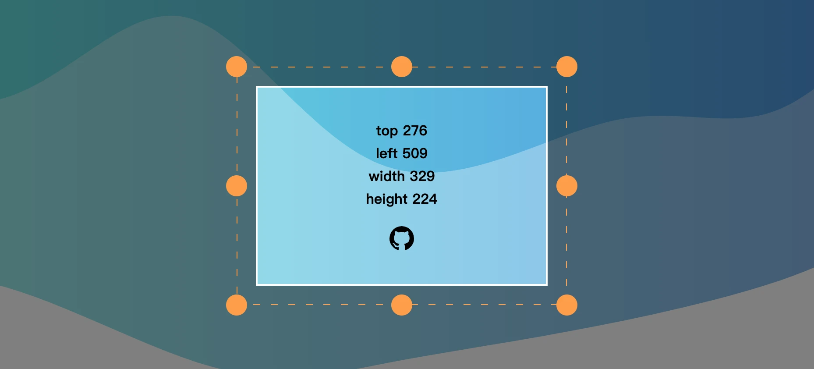

# @rmw/vue3-drag

---



## English Readme

a drag and resizeable vue3 component

[demo link](https://rmw-lib.github.io/vue3-drag/)

The component itself does not contain styles, see `src/index.vue` for demo page styles

### install

```
yarn add -D @rmw/vue3-drag
```

### use

```js
import Drag from '@rmw/vue3-drag'
import '@rmw/vue3-drag/drag.css'
```

```vue
#include src/index.vue
```

---

## 中文说明

一个可拖拽、调整大小的vue3组件

[演示链接](https://rmw-lib.github.io/vue3-drag/)

组件本身不包含样式，演示页面样式见 `src/index.vue`

### 安装

```
yarn add -D @rmw/vue3-drag
```

### 使用

```js
import {drag} from '@rmw/vue3-drag'
import '@rmw/vue3-drag/style.css'
```

```vue
#include src/index.vue
```

背景图是用 https://svgwave.in 创建

## 关于

本项目隶属于**人民网络([rmw.link](//rmw.link))** 代码计划。


